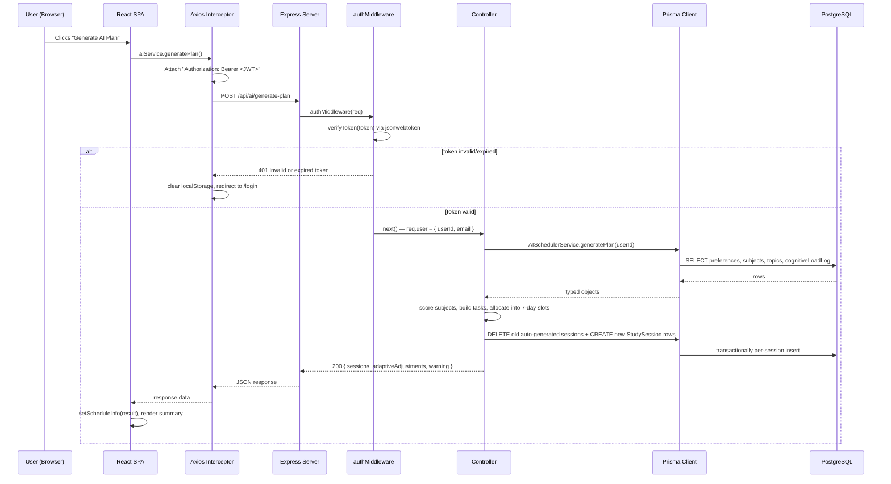

# AI Study Planner — Complete Project Documentation

> **Purpose of this document**: This is not a README. It is a deep-dive reference written so you (the author) can explain every architectural decision, every line of business logic, and every trade-off in this project confidently — in interviews, in code reviews, or six months from now when you've forgotten the details. Every claim below is grounded in the actual code in this repository, with file references so you can jump straight to the source.

---

## Table of Contents
1. [Project Overview](#1-project-overview)
2. [Motivation & Design Decisions](#2-motivation--design-decisions)
3. [Full Tech Stack Breakdown](#3-full-tech-stack-breakdown)
4. [System Architecture](#4-system-architecture)
5. [Folder Structure Deep Dive](#5-folder-structure-deep-dive)
6. [Database Design](#6-database-design)
7. [Frontend Deep Dive](#7-frontend-deep-dive)
8. [Backend Deep Dive](#8-backend-deep-dive)
9. [Core Features Deep Dive](#9-core-features-deep-dive)
10. [Difficult Parts / Engineering Challenges](#10-difficult-parts--engineering-challenges)
11. [Security Considerations](#11-security-considerations)
12. [Performance Optimizations](#12-performance-optimizations)
13. [Scalability Discussion](#13-scalability-discussion)
14. [Testing & Debugging](#14-testing--debugging)
15. [Deployment](#15-deployment)
16. [Resume Explanation](#16-resume-explanation)
17. [Interview Questions](#17-interview-questions)
18. [Code Walkthrough Guide](#18-code-walkthrough-guide)
19. [Improvements / Future Scope](#19-improvements--future-scope)

---

## 1. Project Overview

### Project Name
**AI Study Planner** — a full-stack web application that helps students plan, schedule, and track study time across multiple subjects.

### Problem Statement
Students juggling multiple subjects (or self-learners juggling multiple skills) struggle with three things:
1. **Prioritization** — which subject deserves attention *today*, given deadlines and difficulty?
2. **Scheduling** — how do you turn "I need 40 hours on this subject" into an actual day-by-day calendar?
3. **Burnout awareness** — most planners are blind to how much cognitive effort a student has already spent; they'll happily schedule 8 hours of hard material on a day the student is already fatigued.

A generic to-do list or calendar app doesn't solve any of these — it just stores what you tell it. This project attempts to make the *planning* itself intelligent.

### Why This Project Was Built
It's a practical vehicle for building (and being able to explain) a complete production-shaped full-stack system: authentication, relational data modeling, a REST API, a rule-based decision engine, and a React SPA consuming it — end to end, with real trade-offs at every layer.

### Real-World Use Case
A student adds their subjects ("Data Structures", "Operating Systems", "GATE Prep") with a difficulty rating, total hours needed, and a deadline. They break each subject into topics. The app then:
- Tracks how many hours/topics are completed.
- Computes a **cognitive load score** from the sessions actually completed today.
- Generates a **7-day study schedule** that front-loads urgent/difficult subjects but throttles the daily workload down when the student's cognitive load is high.

### Target Users
- Students preparing for exams with multiple subjects and hard deadlines (the primary persona).
- Self-learners tracking structured learning goals (e.g., interview prep, certifications).
- Anyone who wants a planner that adapts to *how much they've actually been doing*, not just what they intended to do.

### Key Features
| Feature | What it does |
|---|---|
| Auth (register/login) | Email+password auth issuing a JWT |
| Subjects | CRUD for subjects with difficulty (1–5), total/completed hours, deadline, color, prerequisites |
| Topics | Break a subject into ordered, completable topics; bulk-add support |
| Prerequisites | Self-referential many-to-many between subjects (this subject depends on that one) |
| Study Sessions | Scheduled/actual start-end times, status lifecycle, focus score (1–10) |
| Preferences | Study hours/day, preferred time-of-day slots, break duration, max continuous study, learning pace |
| Cognitive Load Engine | Computes a 0–100 daily fatigue score from today's completed sessions |
| AI Scheduler | Generates a 7-day session plan, adapting daily budget/breaks to the load score |
| Dashboard | Stats cards, progress bar chart (Recharts), upcoming deadlines, cognitive load, one-click "Generate AI Plan" |

### High-Level Architecture Summary
A classic 3-tier SPA + REST API + relational DB:

```
React (Vite, TS) SPA  ⇄  Express REST API (TS)  ⇄  PostgreSQL (via Prisma ORM)
        (frontend/)             (backend/)                (backend/prisma/)
```

Auth is stateless JWT (bearer token in `Authorization` header, stored client-side in `localStorage`). There is no server-side session store. The "AI" is a **deterministic, rule-based heuristic engine** written in plain TypeScript — not a machine-learning model and not a call to an LLM API. This is an important distinction to be upfront about in interviews (see [Section 17](#17-interview-questions)).

---

## 2. Motivation & Design Decisions

### Why React (over Angular / Vue)
- Largest ecosystem for the exact pieces this app needed off the shelf: `react-router-dom` for routing, `recharts` for charts, `zustand` for state — all drop-in, minimal boilerplate.
- Component model maps naturally onto this domain: `SubjectCard`, `TopicList`, `StatsCard` are self-contained, reusable, and easy to reason about in isolation.
- **Trade-off**: Angular's batteries-included approach (DI, forms module, RxJS) would have been overkill for an app this size and would have added a steeper learning curve for marginal benefit. Vue would have been equally valid — React was chosen primarily for ecosystem familiarity and job-market relevance.

### Why PostgreSQL (over MongoDB)
The data is inherently **relational**: a `Subject` belongs to a `User`, has many `Topic`s, has many `StudySession`s, and has a self-referential many-to-many relationship with itself via `Prerequisite`. That last one — subjects depending on other subjects — is a graph/relational pattern that Postgres foreign keys express naturally (`backend/prisma/schema.prisma:47-58`). Modeling it in MongoDB would mean either denormalizing (duplicating subject data into arrays) or manually maintaining referential integrity in application code — Postgres does it for free with `ON DELETE CASCADE`.

Additional reasons:
- Strong consistency matters here: `hoursCompleted` on `Subject` is incremented transactionally when a session completes (`backend/src/controllers/session.controller.ts:394-408`). A single source of truth with ACID guarantees avoids drift.
- Prisma's TypeScript-first tooling has first-class Postgres support, generating fully-typed query results.

**Trade-off**: MongoDB would have offered more schema flexibility (useful if the data model were still churning heavily) and horizontal scaling is more "built-in." For this project's read/write patterns (structured, relational, moderate volume) Postgres is the better fit.

### Why Node.js/Express Backend
- Same language (TypeScript) on both client and server — one mental model, shared type definitions could be shared as a package (not currently done, but structurally possible).
- Express is minimal and unopinionated, which suited a project where the "interesting" logic lives in two custom services (`aiScheduler.service.ts`, `cognitiveLoad.service.ts`) rather than in framework machinery. A heavier framework (NestJS) would have added DI containers and decorators for a codebase that's currently ~15 route handlers — not yet justified.

### Why Prisma ORM
- Type-safe query results generated directly from `schema.prisma` — no hand-written SQL, no runtime type mismatches between DB rows and TS types.
- Declarative migrations (`backend/prisma/migrations/`) instead of hand-rolled SQL migration scripts.
- `prisma.config.ts` centralizes the datasource URL from `DATABASE_URL` env var.
- **Trade-off vs. raw SQL / Knex**: Prisma's query builder can't express every possible SQL query (complex windowing functions, for example) — none of that was needed here. Prisma is a productivity win for a CRUD-heavy app with a handful of custom aggregation queries.

### Why Tailwind CSS
- Utility-first classes directly in JSX avoid context-switching to separate CSS files for a UI this component-dense (`className="btn-primary flex items-center gap-2"` patterns throughout `frontend/src/pages/*.tsx`).
- `tailwind.config.js` extends a custom `primary` color palette; a handful of custom component classes (`.btn-primary`, `.card`, `.input-field`) are defined once in `index.css` and reused everywhere — giving Tailwind's speed without utility-class soup on every element.
- **Note**: `@tailwindcss/cli` (v4) is also listed as a dev dependency alongside Tailwind v3.4 (which is what's actually wired up via `postcss.config.js`). This is leftover from an upgrade attempt/exploration and is dead weight — see [Section 19](#19-improvements--future-scope).

### Why Zustand (over Redux/Context)
- Two small, independent slices of client state: `authStore.ts` (user/token) and `subjectStore.ts` (subject list/selection). Redux's boilerplate (actions, reducers, dispatch) is disproportionate to this need.
- Zustand stores are plain hooks (`useAuthStore((state) => state.user)`) — no `<Provider>` wrapper, no context re-render issues, and each selector only re-renders components that read that specific slice.
- **Trade-off**: Most page-level data (subjects, sessions, stats) is *not* in Zustand — it's fetched with `useState`/`useEffect` per page (e.g., `DashboardPage.tsx:34-71`). This means server data isn't globally cached; navigating between pages re-fetches. A tool like React Query/TanStack Query would add caching, dedication, and background refetch — a reasonable next step (see improvements).

### Alternative Architectures Considered (implicitly, in hindsight)
- **Server-rendered (Next.js) instead of SPA + API**: would simplify the "no shared types between client/server" issue and enable SSR, but this project deliberately kept a decoupled API so it could be consumed by other clients (mobile, CLI) in principle.
- **GraphQL instead of REST**: would let the frontend request exactly the fields it needs (subject list responses currently over-fetch topics + prerequisites even on pages that don't render them, e.g. `SubjectController.getAllSubjects`, `backend/src/controllers/subject.controller.ts:100-134`). REST was chosen for simplicity given the API surface is small (~30 endpoints).

---

## 3. Full Tech Stack Breakdown

### Frontend (`frontend/`)

| Tech | What it is | Why used | Where | Problem it solves | Limitations |
|---|---|---|---|---|---|
| **React 19** | UI library | Component-based SPA | Entire `src/` | Declarative UI, reusable components | Client-side rendering only — no SEO/SSR |
| **TypeScript** | Typed superset of JS | Compile-time safety | Every `.tsx`/`.ts` file | Catches type mismatches (e.g., API response shape vs. component props) before runtime | Types can drift from backend if not kept in sync manually (no shared types package) |
| **Vite** | Build tool/dev server | Fast HMR, ESM-native | `vite.config.ts` | Near-instant dev server start/reload vs. webpack | Newer ecosystem than webpack; some older plugins unsupported |
| **React Router v7** | Client-side routing | `BrowserRouter`/`Routes` in `App.tsx` | Route protection via `ProtectedRoute`/`PublicRoute` wrapper components | No route-level code splitting configured (all pages bundle together) |
| **Zustand** | State management | `authStore.ts`, `subjectStore.ts` | Global auth/subject state without Redux boilerplate | No devtools middleware wired up; no persistence middleware (auth persistence is manual via `localStorage` calls inside the store) |
| **Axios** | HTTP client | `services/api.ts` | Centralized instance with request/response interceptors | Auto-attaches JWT, auto-redirects to `/login` on 401 | Base URL is hardcoded to `http://localhost:5000/api` (`api.ts:3`) — not environment-driven |
| **react-hot-toast** | Toast notifications | `showSuccess`/`showError` in `utils/toast.ts`, `<Toaster/>` in `App.tsx` | User feedback on async actions | — |
| **lucide-react** | Icon set | Used throughout pages/components (`<BookOpen/>`, `<Clock/>`, etc.) | Consistent, tree-shakeable SVG icons | — |
| **recharts** | Charting library | `ProgressChart.tsx` | Bar chart of per-subject progress % | Only one chart in the app currently — could be swapped for a lighter lib if bundle size mattered |
| **date-fns** | Date formatting | `format(new Date(subject.deadline), 'MMM d, yyyy')` in `SubjectDetailPage.tsx` | Human-readable dates without moment.js's bundle size | — |
| **Tailwind CSS v3** | Utility-first CSS | `tailwind.config.js`, `index.css` | Fast styling without context-switching to CSS files | — |
| **react-hook-form / zod / @hookform/resolvers** | Form + schema validation | Listed in `package.json` | **Installed but not actually used** — all forms (`LoginPage`, `RegisterPage`, `SubjectForm`, `TopicForm`) use plain `useState` + manual validation | Dead dependency; increases bundle/install size for no benefit |

### Backend (`backend/`)

| Tech | What it is | Why used | Where | Problem it solves | Limitations |
|---|---|---|---|---|---|
| **Node.js + Express 5** | HTTP server framework | `src/index.ts` | Routes, middleware, JSON body parsing | Minimal ceremony for a small REST API | No built-in DI, validation, or OpenAPI generation — all hand-rolled |
| **TypeScript** | Typed Node | Entire `src/` | Type safety across controllers/services | Compiled via `tsc` to `dist/` for production (`package.json` `build` script) |
| **Prisma ORM (5.22)** | Type-safe DB client + migrations | `prisma/schema.prisma`, `src/utils/prisma.ts` | Generates TS types from schema; `PrismaClient` used everywhere for queries | Adds an abstraction layer; some advanced SQL still needs raw queries (not used yet here) |
| **PostgreSQL** | Relational database | `DATABASE_URL` env var | Stores all persistent data | Relational integrity (FKs, cascades) for the subject/topic/session/prerequisite graph |
| **jsonwebtoken** | JWT signing/verification | `src/utils/jwt.ts` | Stateless auth tokens, 7-day expiry | No refresh-token flow — token simply expires and user must re-login |
| **bcryptjs** | Password hashing | `src/utils/password.ts`, salt rounds = 10 | One-way password hashing before storage | Pure-JS bcrypt (slightly slower than native `bcrypt`, but no native build step — good for portability) |
| **cors** | CORS middleware | `app.use(cors())` in `src/index.ts:18` | Allows the frontend origin to call the API | Configured with **no origin restriction** — accepts requests from any origin (security note, see Section 11) |
| **dotenv** | Env var loading | `dotenv.config()` in `index.ts`, `prisma.config.ts` | Loads `.env` into `process.env` | — |
| **ts-node-dev** | Dev-time TS runner with auto-restart | `npm run dev` script | Fast local iteration without manual compile step | Dev-only; production uses compiled `dist/` via `tsc` + `node` |

### Database / ORM
Covered in depth in [Section 6](#6-database-design).

### Authentication
Custom-built (not a library like Passport/Auth0/Clerk): register/login controllers hash passwords with bcrypt, issue a JWT containing `{ userId, email }`, and an Express middleware (`authMiddleware`) validates the `Bearer` token on every protected route. See [Section 8](#8-backend-deep-dive) and [Section 9](#9-core-features-deep-dive).

### APIs
A REST API under `/api/*`, fully documented in [Section 8](#8-backend-deep-dive).

### State Management
Covered above (Zustand) and in [Section 7](#7-frontend-deep-dive).

### Deployment
Currently **not deployed** — see [Section 15](#15-deployment) for what exists (a stub) vs. what's needed.

### Dev Tools
- **ESLint** (`eslint.config.js`, flat config) with `typescript-eslint`, `eslint-plugin-react-hooks`, `eslint-plugin-react-refresh` — frontend only.
- **Prisma Studio** (`npm run prisma:studio`) — visual DB browser during development.
- **Git** — 5 commits total, showing an incremental build order: initial scaffold → preferences → navigation/layout polish → AI features branch → rule-based heuristic/cognitive load/adaptive scheduler (see `git log`).

### Testing
**None currently implemented** — no test runner (Jest/Vitest), no test files (`*.test.*`/`*.spec.*`) anywhere in the repo. This is an honest gap, addressed directly in [Section 14](#14-testing--debugging) and [Section 19](#19-improvements--future-scope).

---

## 4. System Architecture

### Request-Response Lifecycle (general case)



### Layered Flow (textual)

```
User → React UI (pages/) → services/*.ts (Axios) → Express Router (routes/)
    → authMiddleware (JWT check) → Controller (validation + orchestration)
    → Service (business logic, only for AI features) → Prisma Client
    → PostgreSQL → results bubble back up → JSON response → React state update → re-render
```

### Frontend Flow
1. `main.tsx` mounts `<App/>`.
2. `App.tsx` sets up `BrowserRouter` with `ProtectedRoute`/`PublicRoute` wrappers gated on `useAuthStore().isAuthenticated`.
3. On mount, `loadFromStorage()` rehydrates auth state from `localStorage` (so refreshing the page doesn't log the user out).
4. Each page component (`DashboardPage`, `SubjectsPage`, etc.) fetches its own data in a `useEffect` via a `services/*.ts` module, holds it in local `useState`, and renders.
5. Mutations (create/update/delete) call the service, then optimistically or reactively update local state and show a toast.

### Backend Flow
1. `index.ts` boots Express, registers global middleware (`cors()`, `express.json()`, `express.urlencoded()`), then mounts six routers under `/api/*`.
2. Every router except `auth.routes.ts`'s `register`/`login` applies `authMiddleware` (either per-route or via `router.use(authMiddleware)` for the whole router).
3. Controllers are **static classes** (`export class SubjectController { static async createSubject(...) }`) — no instantiation, just namespacing. Each method: reads `req.user.userId` (attached by middleware), validates `req.body`, calls Prisma, shapes the response, and returns.
4. For the two AI endpoints, controllers delegate to a **service class** that contains the actual algorithm (`AISchedulerService`, `CognitiveLoadService`) — this is the one place business logic is separated from HTTP concerns.

### Database Flow
Prisma Client (`src/utils/prisma.ts`) is instantiated once and imported everywhere — a singleton connection pool. Every query is scoped by `userId` (either directly in the `where` clause, or by joining through a relation and checking ownership) to enforce that users can only see/modify their own data — there's no row-level security at the DB layer, it's enforced in application code in every controller.

---

## 5. Folder Structure Deep Dive

```
Ai-study-planner/
├── database-schema.md          # Hand-written schema notes (predates/mirrors schema.prisma)
├── backend/
│   ├── api/index.ts             # Empty stub — intended Vercel serverless entrypoint (unfinished)
│   ├── prisma/
│   │   ├── schema.prisma        # Single source of truth for the DB model
│   │   └── migrations/          # One squashed "init" migration + lock file
│   ├── prisma.config.ts         # Points Prisma CLI at DATABASE_URL
│   ├── src/
│   │   ├── index.ts             # Express app bootstrap, route mounting
│   │   ├── controllers/         # One file per resource; HTTP-facing logic
│   │   ├── services/            # Business logic for AI features only
│   │   ├── middleware/          # authMiddleware (JWT verification)
│   │   ├── routes/               # One Router per resource, wires paths → controller methods
│   │   ├── types/               # Request/response TS interfaces per domain
│   │   └── utils/               # jwt.ts, password.ts, prisma.ts (singleton client)
│   └── tsconfig.json
└── frontend/
    ├── src/
    │   ├── main.tsx              # ReactDOM.createRoot entrypoint
    │   ├── App.tsx                # Router + route guards
    │   ├── pages/                 # One component per route (Login, Dashboard, Subjects, ...)
    │   ├── components/
    │   │   ├── common/            # Modal, LoadingSpinner — generic, reusable
    │   │   ├── layout/             # AppLayout — nav bar + page shell
    │   │   ├── dashboard/          # StatsCard, ProgressChart, UpcomingDeadlines, RecentSubjects
    │   │   ├── subjects/           # SubjectCard, SubjectForm
    │   │   └── topics/             # TopicList, TopicForm, BulkTopicForm
    │   ├── services/               # api.ts (axios instance) + one service module per resource
    │   ├── store/                  # Zustand stores (auth, subject)
    │   ├── types/index.ts          # All shared TS interfaces (mirrors backend response shapes)
    │   └── utils/                  # error.ts (API error extraction), toast.ts (toast wrappers)
    ├── vite.config.ts              # Dev server, proxy, "@/" path alias
    └── tailwind.config.js
```

### Why each major piece exists

- **`controllers/` vs `services/`**: Only `ai.controller.ts` delegates to a service (`aiScheduler.service.ts`, `cognitiveLoad.service.ts`). Every other resource (subjects, topics, sessions, preferences) does its logic directly inside the controller. This is an intentional (if slightly inconsistent) split: the AI features have genuinely complex, multi-step algorithms worth isolating and unit-testing in principle; plain CRUD didn't warrant the extra layer. In a larger codebase you'd want a consistent controller→service→repository layering throughout — see [Section 19](#19-improvements--future-scope).
- **`types/` (backend)**: Per-domain request/response interfaces (`auth.types.ts`, `subject.types.ts`, etc.) used to type `req.body` destructuring in controllers — a lightweight substitute for full runtime validation (there's no Zod/Joi validation layer; validation is manual `if` checks in each controller).
- **`middleware/auth.middleware.ts`**: The single chokepoint for authentication. Every protected router calls `router.use(authMiddleware)` once, rather than repeating the check per route.
- **`store/` (frontend)**: Only two Zustand stores exist because only two pieces of state are genuinely global/cross-page: "who is logged in" and "what subjects exist" (used by `SubjectForm` to populate the prerequisites dropdown from a different page's fetch). Everything else is page-local `useState`.
- **`services/` (frontend)**: A thin wrapper per backend resource (`subjectService.getAll()`, `topicService.create()`, etc.) so pages never call `axios`/`api` directly — one place to change if an endpoint shape changes.
- **`api/index.ts` (backend)**: This file is currently **empty**. Its presence (an `api/` folder at the backend root) is a strong signal of an abandoned or planned Vercel serverless deployment (Vercel auto-detects `api/*.ts` as serverless functions). It was never filled in — flagged honestly in [Section 15](#15-deployment).

---

## 6. Database Design

### Entity-Relationship Diagram

```mermaid
erDiagram
    USER ||--o{ SUBJECT : owns
    USER ||--o{ STUDY_SESSION : owns
    USER ||--o| USER_PREFERENCES : has
    USER ||--o{ COGNITIVE_LOAD_LOG : has
    SUBJECT ||--o{ TOPIC : contains
    SUBJECT ||--o{ STUDY_SESSION : "studied in"
    SUBJECT ||--o{ PREREQUISITE : "requires (as subject)"
    SUBJECT ||--o{ PREREQUISITE : "required by (as prerequisite)"
    TOPIC ||--o{ STUDY_SESSION : "focus of"

    USER {
        string id PK
        string email UK
        string password
        string fullName
        datetime createdAt
        datetime updatedAt
    }
    SUBJECT {
        string id PK
        string userId FK
        string name
        int difficultyLevel "1-5"
        float totalHoursRequired
        float hoursCompleted
        datetime deadline "nullable"
        string color
    }
    PREREQUISITE {
        string id PK
        string subjectId FK
        string prerequisiteSubjectId FK
    }
    TOPIC {
        string id PK
        string subjectId FK
        string name
        float estimatedHours
        boolean isCompleted
        int order
    }
    STUDY_SESSION {
        string id PK
        string userId FK
        string subjectId FK
        string topicId FK "nullable"
        datetime scheduledStart
        datetime scheduledEnd
        datetime actualStart "nullable"
        datetime actualEnd "nullable"
        enum status "SCHEDULED|IN_PROGRESS|COMPLETED|MISSED"
        int focusScore "1-10, nullable"
    }
    USER_PREFERENCES {
        string id PK
        string userId FK UK
        float studyHoursPerDay
        json preferredStudyTimes
        int breakDuration
        int maxContinuousStudy
        enum learningPace "SLOW|MEDIUM|FAST"
    }
    COGNITIVE_LOAD_LOG {
        string id PK
        string userId FK
        date date
        float totalLoadScore
        json subjectsStudied
    }
```

### Table-by-table

**`users`** — one row per account. `email` is unique (enforced at DB level, `@@unique` in Prisma → `users_email_key` index in the migration). `password` stores a bcrypt hash, never plaintext. Cascade-deletes everything owned by the user (`onDelete: Cascade` on every child relation) — deleting a user cleanly removes all their subjects, sessions, preferences, and load logs.

**`subjects`** — the core planning unit. `difficultyLevel` (1–5) and `totalHoursRequired`/`hoursCompleted` are the two inputs the scheduler's priority formula consumes. `deadline` is nullable — subjects without a deadline get a default 30-day planning horizon in the scheduler (`aiScheduler.service.ts:169`). `color` is a hex string used purely for UI (chart bars, badges).

**`prerequisites`** — a **self-referential many-to-many** on `Subject`, implemented as an explicit join table (not Prisma's implicit `many-to-many`, because Prisma requires named relations when both sides point to the same model). Two named relations (`"SubjectPrerequisites"` and `"PrerequisiteSubjects"`) disambiguate "the subject that has a prerequisite" from "the subject that *is* a prerequisite." `@@unique([subjectId, prerequisiteSubjectId])` prevents duplicate edges. Note: **this graph is not currently used by the scheduling algorithm** — it's stored and displayed (subject detail page shows prerequisite progress) but `aiScheduler.service.ts` does not topologically sort or block scheduling based on incomplete prerequisites. That's a real gap — see [Section 10](#10-difficult-parts--engineering-challenges) and [Section 19](#19-improvements--future-scope).

**`topics`** — ordered checklist items within a subject. `order` (integer) drives display and scheduling sequence; `isCompleted` is a simple boolean toggle. `estimatedHours` per topic is used by the scheduler to proportionally split a subject's remaining time across its incomplete topics.

**`study_sessions`** — the actual calendar events, both AI-generated and manually created. The `status` enum (`SCHEDULED → IN_PROGRESS → COMPLETED`/`MISSED`) models a session lifecycle. `scheduledStart/End` vs `actualStart/End` are deliberately separate columns: the plan can differ from what actually happened, and that gap (actual duration, actual focus) is exactly what the cognitive-load engine measures. `topicId` is nullable with `onDelete: SetNull` — deleting a topic shouldn't destroy the historical record that a session happened, just detach it.

**`user_preferences`** — one-to-one with `User` (`@unique` on `userId`). Drives the scheduler's constraints: how many minutes/day, which time-of-day windows, how long a continuous block can run before a break, and break length. `preferredStudyTimes` is stored as JSON (`Json` type, mapped to Postgres `JSONB`) rather than a normalized join table, because it's a small, order-independent set of enum-like strings (`["morning","evening"]`) — not worth a separate table for.

**`cognitive_load_logs`** — one row per user per calendar day (`@@unique([userId, date])`, enforced via `upsert` in `CognitiveLoadService`). `subjectsStudied` is a JSON array of subject IDs studied that day — again, a denormalized array chosen over a join table because it's write-once/append-style summary data, not something that's individually queried or joined against.

### Why this schema shape
- **Normalized where integrity matters** (users → subjects → topics → sessions, all proper FKs with cascades) because these are the entities the app performs relational queries against (e.g., "give me all incomplete topics for subject X ordered by `order`").
- **Denormalized (JSON) where the data is a small, self-contained blob that's always read/written as a unit** (`preferredStudyTimes`, `subjectsStudied`) — avoids join overhead for data that's never queried by its individual elements.
- **UUIDs (`@default(uuid())`) as primary keys**, not auto-increment integers — makes IDs non-guessable/non-enumerable (a user can't infer how many subjects exist globally from an ID) and safe to generate client-side if ever needed, at the cost of slightly larger index size vs. integers.

### Indexing
Beyond the primary keys, the migration creates:
- `users_email_key` (unique) — supports the login lookup (`findUnique({ where: { email } })`) with an index instead of a table scan.
- `prerequisites_subject_id_prerequisite_subject_id_key` (unique composite) — prevents duplicate edges and speeds up "does this edge exist" checks.
- `user_preferences_user_id_key` (unique) — supports the 1:1 lookup.
- `cognitive_load_logs_user_id_date_key` (unique composite) — supports both the uniqueness constraint (one log per user per day) and fast "get today's log" lookups.

**Missing indexes worth adding** (see [Section 12](#12-performance-optimizations)): `subjects(userId)`, `topics(subjectId)`, and `study_sessions(userId, scheduledStart)` are all queried by foreign key + range constantly but only have the FK itself (Postgres does index FK columns referenced by constraints in some cases, but explicit composite indexes on `(userId, ...)` for the hot query paths would help at scale).

### Migration history
There is exactly **one** migration (`20260531081034_init`), containing the entire schema as of the last commit. This means the schema was iterated locally via `prisma db push` (a `package.json` script exists for this: `prisma:push`) during development, and only formalized into a versioned migration once. In a team setting you'd want every schema change to be its own migration for auditability and safe production rollout — worth mentioning honestly if asked about migration discipline.

---

## 7. Frontend Deep Dive

### UI Architecture
Page-per-route, layout wrapper pattern: every authenticated page wraps its content in `<AppLayout>` (`components/layout/AppLayout.tsx`), which renders the top nav bar (desktop + mobile hamburger variants) and user menu, then renders `children`. This avoids repeating nav markup on every page.

### Component Hierarchy (Dashboard example)
```
App
 └─ ProtectedRoute
     └─ DashboardPage
         └─ AppLayout
             ├─ StatsCard × 4        (pure, presentational)
             ├─ Cognitive Load card   (inline JSX, not extracted)
             ├─ AI Scheduler card     (inline JSX, calls aiService.generatePlan)
             ├─ ProgressChart         (recharts wrapper)
             ├─ UpcomingDeadlines
             └─ RecentSubjects
```

### State Management
- **Global (Zustand)**: `authStore` (user, token, isAuthenticated) and `subjectStore` (subjects list, selected subject, loading flag). Read via selector hooks, e.g. `useAuthStore((state) => state.user)` — this pattern means a component only re-renders when the *specific slice it selects* changes, not on every store update.
- **Local (useState)**: All page-fetched data (dashboard stats, subject detail, topics, preferences form state) lives in component-local state, fetched in `useEffect` on mount. There is no shared server-state cache — navigating away and back re-fetches from scratch.

### Routing
`react-router-dom` v7, declarative `<Routes>` in `App.tsx`. Two guard components:
```tsx
function ProtectedRoute({ children }) {
  const isAuthenticated = useAuthStore((state) => state.isAuthenticated);
  return isAuthenticated ? <>{children}</> : <Navigate to="/login" />;
}
function PublicRoute({ children }) {
  const isAuthenticated = useAuthStore((state) => state.isAuthenticated);
  return isAuthenticated ? <Navigate to="/dashboard" /> : <>{children}</>;
}
```
`PublicRoute` prevents a logged-in user from seeing `/login`/`/register` again; `ProtectedRoute` prevents an unauthenticated user from reaching any app page. Unknown paths (`*`) redirect to `/login`.

### Forms
All forms are **uncontrolled-free, plain controlled components**: a single `formData` object in `useState`, updated via spread (`setFormData({ ...formData, field: value })`) on every `onChange`. Validation is manual and minimal — mostly HTML5 `required`/`min`/`type="email"` attributes plus a few explicit JS checks (e.g., `RegisterPage.tsx:25-33` checks password match and minimum length before submitting). `react-hook-form`/`zod` are installed but unused — see [Section 19](#19-improvements--future-scope).

### API Integration
Every service module (`subjectService.ts`, `topicService.ts`, etc.) wraps `api` (the shared Axios instance) and returns `response.data` typed against interfaces in `types/index.ts`. The Axios instance itself (`services/api.ts`) has two interceptors:
- **Request**: reads the JWT from `localStorage` and attaches `Authorization: Bearer <token>` to every outgoing request.
- **Response**: on any `401`, clears `localStorage` and hard-redirects (`window.location.href = '/login'`) — a blunt but effective global session-expiry handler.

### Error Handling
`utils/error.ts` exports `getApiErrorMessage(error, fallback)` — a type-guarded function that reaches into `error.response.data.error` (the shape every backend controller returns on failure) and falls back to a generic message if the shape doesn't match. Every page's `catch` block funnels through this into a `showError()` toast (`utils/toast.ts` wraps `react-hot-toast`).

### Re-render Optimization
Minimal explicit optimization — no `React.memo`, `useMemo`, or `useCallback` usage found anywhere in the codebase. This is a reasonable choice at the current scale (lists are small — a handful of subjects/topics per user) but would need attention if lists grew large (see [Section 12](#12-performance-optimizations)).

### React Concepts Used
- `useState` — everywhere, for local component state.
- `useEffect` — data fetching on mount (`[]` deps) and on param change (`[id]` deps in `SubjectDetailPage`).
- `useNavigate`/`useParams`/`useLocation` — routing.
- **Zustand hooks** (not React Context) for cross-page shared state — selector-based subscription avoids the "everything re-renders" problem plain Context has without careful `useMemo`/multiple contexts.
- No custom hooks, no `useReducer`, no `useContext` are used — state logic is kept intentionally simple/local per page.

---

## 8. Backend Deep Dive

### Server Setup
`src/index.ts`: creates an Express app, applies `cors()` (unrestricted), `express.json()`, `express.urlencoded({ extended: true })`, mounts six routers, adds a root info route (`GET /`), a `GET /health` check, and a catch-all `404` handler. Listens on `process.env.PORT || 5000`.

### Middleware
Only one custom middleware exists: `authMiddleware` (`src/middleware/auth.middleware.ts`). It:
1. Reads `Authorization` header, requires a `Bearer ` prefix.
2. Strips the prefix, calls `verifyToken(token)` (wraps `jsonwebtoken.verify`).
3. On success, attaches the decoded payload (`{ userId, email }`) to `req.user` (via `@ts-ignore`, since Express's `Request` type isn't augmented with a `user` field in a `.d.ts` — a small type-safety gap).
4. On failure (missing header, invalid/expired token), responds `401` immediately without calling `next()`.

### Routing
Six Express Routers, each mounted once in `index.ts`:
| Base path | Router file | Protected? |
|---|---|---|
| `/api/auth` | `auth.routes.ts` | Mixed — `register`/`login` public, `GET /me` protected |
| `/api/subjects` | `subject.routes.ts` | Fully protected (`router.use(authMiddleware)`) |
| `/api/topics` | `topic.routes.ts` | Fully protected |
| `/api/preferences` | `preferences.routes.ts` | Fully protected |
| `/api/sessions` | `session.routes.ts` | Fully protected |
| `/api/ai` | `ai.routes.ts` | Fully protected |

### Controllers
Static-method classes, one per resource. Consistent shape across all of them: `try { validate → prisma call → shape response → res.status(x).json(...) } catch { console.error; res.status(500).json({ error }) }`. No shared error-handling middleware — every controller method has its own `try/catch` (a repeated pattern; see improvements).

### Services (business logic layer)
Only the AI feature has a service layer:
- **`AISchedulerService.generatePlan(userId)`** — see full breakdown in [Section 9](#9-core-features-deep-dive).
- **`CognitiveLoadService.calculateDailyLoad(userId)` / `getTodayLoad(userId)`** — see [Section 9](#9-core-features-deep-dive).

### Validation
No schema-validation library (no Zod/Joi/express-validator) on the backend. Every controller manually checks required fields and value ranges with `if` statements before touching the database, e.g.:
```ts
if (difficultyLevel < 1 || difficultyLevel > 5) {
  return res.status(400).json({ error: 'Difficulty level must be between 1 and 5' });
}
```
This is functional but repetitive and easy to forget on a new field — a validation middleware (Zod schemas per route) would remove this duplication (see [Section 19](#19-improvements--future-scope)).

### Error Handling
Per-method `try/catch`, logs to `console.error`, returns a generic `{ error: 'Internal server error' }` with `500` for unexpected failures, or a specific message + `4xx` for validation/not-found/ownership failures. There is no centralized Express error-handling middleware (`(err, req, res, next) => {}`) — every route handles its own errors inline.

### Full API Reference

#### Auth (`/api/auth`)
| Method | Path | Auth | Body | Response |
|---|---|---|---|---|
| POST | `/register` | Public | `{ email, password, fullName }` | `201 { user, token }` (also creates default `UserPreferences`) |
| POST | `/login` | Public | `{ email, password }` | `200 { user, token }` |
| GET | `/me` | JWT | — | `200 { user }` |

**Flow for `POST /register`** (`auth.controller.ts:9-72`): validate required fields → check email uniqueness → `bcrypt.hash(password, 10)` → `prisma.user.create()` → `prisma.userPreferences.create({ data: { userId } })` (defaults applied by the schema) → sign JWT → respond `201`.

#### Subjects (`/api/subjects`)
| Method | Path | Notes |
|---|---|---|
| POST | `/` | Creates subject + optional `prerequisiteIds` (creates join rows) |
| GET | `/` | All subjects for user, with topics + prerequisites + computed `progress` |
| GET | `/stats` | Aggregate stats: total hours, overall progress, difficulty distribution, upcoming deadlines (next 7 days) |
| GET | `/:id` | Single subject, ownership-checked, includes last 10 sessions |
| PUT | `/:id` | Partial update; can replace prerequisite set |
| DELETE | `/:id` | Cascade-deletes topics/sessions/prerequisite edges via DB FK cascade |

#### Topics (`/api/topics`)
| Method | Path | Notes |
|---|---|---|
| POST | `/` | Single topic create; auto-computes next `order` if omitted |
| POST | `/bulk` | Bulk create (used by "Add Multiple Topics" UI) |
| GET | `/subject/:subjectId` | All topics for a subject + completion stats |
| GET | `/:id` | Single topic, ownership verified through `topic.subject.userId` |
| PUT | `/:id` | Partial update |
| DELETE | `/:id` | — |
| PATCH | `/:id/toggle` | Flip `isCompleted` |
| PUT | `/subject/:subjectId/reorder` | Bulk-updates `order` field from an array of topic IDs |

#### Sessions (`/api/sessions`)
| Method | Path | Notes |
|---|---|---|
| POST | `/` | Manual session creation, validates `end > start` |
| GET | `/` | Filterable by `status`, `subjectId`, `startDate`/`endDate` |
| GET | `/stats` | Totals, completion rate, avg focus score |
| GET | `/:id` | — |
| PUT | `/:id` | Generic field update |
| DELETE | `/:id` | — |
| PATCH | `/:id/start` | Sets `status=IN_PROGRESS`, `actualStart=now()` |
| PATCH | `/:id/complete` | Sets `status=COMPLETED`, `actualEnd=now()`, optional `focusScore`/`notes`, **and increments `subject.hoursCompleted`** by the actual duration |

#### Preferences (`/api/preferences`)
| Method | Path | Notes |
|---|---|---|
| GET | `/` | Lazily creates defaults if none exist |
| PUT | `/` | Validated ranges (e.g., `studyHoursPerDay` 0.5–24, `breakDuration` 5–60min) |
| POST | `/reset` | Resets to hardcoded defaults |

#### AI (`/api/ai`)
| Method | Path | Notes |
|---|---|---|
| POST | `/generate-plan` | Runs `AISchedulerService.generatePlan` |
| POST | `/calculate-load` | Runs `CognitiveLoadService.calculateDailyLoad` for *today* |
| GET | `/load-today` | Fetches today's already-computed `CognitiveLoadLog` (or `null`) |

**Example flow — `POST /api/sessions/:id/complete`:**
```
Request → authMiddleware verifies JWT → SessionController.completeSession
  → find session (ownership implicit via userId in where clause)
  → validate focusScore range if provided
  → prisma.studySession.update(status=COMPLETED, actualEnd=now, focusScore, notes)
  → compute hoursStudied = (actualEnd - actualStart) / 3600000
  → prisma.subject.update({ hoursCompleted: { increment: hoursStudied } })
  → 200 { session }
```

---

## 9. Core Features Deep Dive

### Feature: Authentication

**Problem solved**: Every other feature needs to know *whose* data it's reading/writing. JWT auth provides that identity without server-side session storage.

**Frontend**: `LoginPage`/`RegisterPage` collect credentials via controlled inputs → `authService.login/register` → on success, `useAuthStore().setAuth(user, token)` writes both to `localStorage` *and* Zustand state → `navigate('/dashboard')`.

**Backend**: `AuthController.register/login` (see [Section 8](#8-backend-deep-dive) for the full flow). Password comparison uses `bcrypt.compare` (constant-time), never a direct string comparison.

**DB interaction**: One `User` row created per registration; a `UserPreferences` row is created in the *same request* with defaults, so every user always has preferences (the scheduler depends on this — `AISchedulerService.generatePlan` throws if preferences are missing, which should never happen given this invariant, but `PreferencesController.getPreferences` also defensively lazy-creates them if somehow absent).

**Edge cases handled**: duplicate email registration (400), wrong password/nonexistent email (both return the same generic `401 Invalid credentials` — deliberately not revealing *which* field was wrong, a basic enumeration-prevention practice), missing/expired/malformed JWT (401 via middleware).

**Edge cases NOT handled**: no email verification, no password-reset flow, no rate limiting on login attempts (brute-force is possible), no account lockout.

### Feature: Subject & Topic Management

**Problem solved**: Turning "I need to learn X" into a structured, trackable unit of work (subject) broken into a checklist (topics).

**Frontend**: `SubjectsPage` lists `SubjectCard`s; `SubjectForm` (modal) handles create/edit with a color picker and a multi-select `<select multiple>` for prerequisites. `SubjectDetailPage` shows progress, prerequisites, and the topic list, with three modals (add topic, bulk-add, delete confirm).

**Backend**: Standard CRUD in `SubjectController`/`TopicController`, but with a computed `progress` field derived on every read (`Math.round((hoursCompleted / totalHoursRequired) * 100)`) — **not stored**, always calculated, so it can never drift from the source numbers.

**Interesting detail — the "toggle topic" hours sync**: When a user checks off a topic as complete on the frontend (`SubjectDetailPage.handleToggleComplete`), the client:
1. Calls `topicService.toggleComplete(topic.id)`.
2. Computes `hoursDifference = ±topic.estimatedHours` based on the new state.
3. Calls `subjectService.update(subject.id, { hoursCompleted: newHoursCompleted })` **from the client**, computing the new total itself.

This is a **client-computed, two-request update** rather than a single atomic backend operation — a potential data-integrity issue explored in [Section 10](#10-difficult-parts--engineering-challenges).

**Edge cases handled**: hours completed clamped to `≥ 0` (`Math.max(0, ...)`), difficulty level range-validated 1–5, deleting a subject cascades to topics/sessions/prerequisites automatically via DB constraints.

### Feature: Cognitive Load Engine

**Problem solved**: Quantify how mentally taxed the student is *today*, based on what they actually did (not what was planned), so the scheduler can throttle tomorrow's load accordingly.

**Algorithm** (`CognitiveLoadService.calculateDailyLoad`, `backend/src/services/cognitiveLoad.service.ts:26-177`):
1. Fetch all `COMPLETED` sessions whose `actualEnd` falls within *today* (midnight to midnight, server local time).
2. If none exist → load score `0`, state `"Fresh"`.
3. Otherwise, for each completed session, accumulate:
   - `totalStudyMinutes` (from `actualEnd - actualStart`)
   - `totalDifficulty` (sum of each session's subject's `difficultyLevel`)
   - `focusSum`/`focusCount` (from `focusScore`, if the user logged one)
   - the set of distinct subjects studied
4. Derive four normalized 0–100 sub-scores:
   - `studyHoursScore = clamp((totalStudyHours / 8) * 100, 0, 100)` — more hours = more load, capped at an assumed 8h/day ceiling.
   - `difficultyScore = clamp((avgDifficulty / 5) * 100, 0, 100)` — harder subjects = more load.
   - `breakPenalty = clamp((totalStudyMinutes / maxContinuousStudy) * 20, 0, 100)` — proxies "how many break-sized chunks did you study without necessarily resting" (approximate; it's not tracking actual breaks taken, just how much continuous-study-equivalent time accumulated).
   - `focusPenalty = clamp(((10 - avgFocus) / 9) * 100, 0, 100)` — low self-reported focus = high penalty (defaults `avgFocus = 7` if no focus scores were logged, a moderate/neutral assumption).
5. Weighted sum: **`loadScore = 0.35·studyHours + 0.30·difficulty + 0.15·breakPenalty + 0.20·focus`** — study duration and subject difficulty dominate, break/focus refine it.
6. Map to a state: `Fresh (≤30)`, `Normal (≤60)`, `Fatigued (≤80)`, `Burnout Risk (>80)`.
7. **Upsert** into `cognitive_load_logs` keyed on `(userId, date)` — recalculating for the same day overwrites, it doesn't accumulate duplicate rows.

**Why these specific weights (0.35/0.30/0.15/0.20)?** They're a reasoned but hand-tuned heuristic, not derived from data — study time and difficulty are the two strongest, most direct proxies for cognitive effort; break-taking and focus quality are secondary modifiers. This is explicitly *not* machine-learned; being honest about that in an interview is a strength (see [Section 17](#17-interview-questions)).

### Feature: AI Scheduler (Adaptive Study Plan Generation)

**Problem solved**: Convert "N subjects, each needing X hours by deadline Y" plus "today's fatigue level" into concrete calendar blocks the student can follow for the next week.

**Algorithm** (`AISchedulerService.generatePlan`, `backend/src/services/aiScheduler.service.ts:316-533`), step by step:

1. **Load inputs**: user preferences, the most recent `CognitiveLoadLog` (if any — defaults to `loadScore = 0` if none exists yet), and all subjects (with topics) ordered by deadline then creation date.

2. **Score every subject** (`scoreSubject`, lines 149-187):
   ```
   remainingMinutes = (totalHoursRequired - hoursCompleted) * 60
   daysLeft = deadline ? ceil((deadline - today) / 1 day), min 1 : 30 (default horizon)
   urgencyScore   = deadline ? clamp(30/daysLeft, 1, 10) : 3
   difficultyScore = clamp(difficultyLevel * 2, 1, 10)
   remainingScore  = clamp(remainingHours / 2, 1, 10)
   priority = 0.45·urgency + 0.30·difficulty + 0.25·remaining
   ```
   Urgency dominates (45%) — a subject due in 2 days should crowd out a subject due in 30 days even if the latter is harder. Subjects with zero remaining time are filtered out entirely (already done).

3. **Adapt the daily plan to today's cognitive load** (`applyCognitiveLoadAdjustments`, lines 196-231) — this is the "adaptive" part:

   | Load state | Daily budget | Break length | Difficulty threshold (for "hard subject" treatment) |
   |---|---|---|---|
   | Fresh (≤30) | 100% | 100% | 5 |
   | Normal (≤60) | 90% | 120% | 5 |
   | Fatigued (≤80) | 75% | 150% | 4 |
   | Burnout Risk (>80) | 50% | 200% | 3 |

   As fatigue rises, the scheduler shrinks how many total minutes it will assign per day *and* stretches breaks between sessions *and* lowers the bar for what counts as a "hard" subject (which then gets special treatment — see next step).

4. **Build a flat task list** (`buildTasks`, lines 233-301): for each subject with remaining time, if it's "hard" relative to the current threshold (`difficultyLevel > difficultyThreshold`), its topics are relabeled `"Revision: <topic>"` and their allocated time is **halved** and priority **discounted by 30%** — the intuition being: when fatigued, don't front-load deep new material in a subject already flagged difficult; give it lighter, review-style treatment instead. Subjects with no remaining topics but remaining hours (e.g., topics were never added) get a synthetic "Light Revision" task. Each subject's remaining minutes are proportionally distributed across its incomplete topics based on their relative `estimatedHours`.

5. **Greedy weekly allocation** (lines 428-503): For each of the next 7 days, for each of the user's preferred time-of-day slots (`morning`/`afternoon`/`evening`/`night`, each a fixed clock-time window — `night` wraps past midnight), repeatedly:
   - Pick the highest-priority task with remaining time (`pickNextTask` — same sort as task-building: priority desc, then days-left asc, then topic order asc).
   - Compute a chunk size = `min(task remaining, day budget remaining, slot time remaining, maxContinuousStudy)`.
   - If the chunk would be under 20 minutes, abandon that task for the day (avoids scheduling useless 5-minute slivers) rather than looping forever.
   - Create a `StudySession` row (`status: SCHEDULED`, tagged `notes: "Auto-generated study plan for ..."`).
   - Advance the clock by the session length **plus the adjusted break duration** before considering the next chunk.
   - Stop the day when the daily budget or all slot windows are exhausted; stop the whole run after 7 days or when every task is fully allocated.

6. **Idempotent regeneration**: before creating new sessions, it deletes any existing `SCHEDULED` sessions in the upcoming 7-day window whose `notes` contain `"Auto-generated study plan"` (line 414-426) — so clicking "Generate AI Plan" again replaces the previous auto-plan rather than duplicating it, while leaving **manually created** sessions untouched (they don't have that notes tag).

7. **Response**: total sessions created, total minutes scheduled, any `unallocatedMinutes` (content that didn't fit in the 7-day window — surfaced to the user as a warning to "reduce scope or increase available time"), and the full `adaptiveAdjustments` object (original vs. adjusted budget/break, current load score/state) so the frontend can show *why* the plan looks the way it does.

**Frontend**: `DashboardPage`'s "AI Scheduler" card calls `aiService.generatePlan()` on click, shows a loading state, then renders the before/after budget and break numbers plus a warning banner if not everything fit.

**Challenges/edge cases handled**: subjects with zero topics (synthetic revision task), subjects already fully completed (filtered out early, and an explicit `"All subjects are already completed"` error if *every* subject is done), no subjects at all (explicit error), a preferred-time slot that crosses midnight (`night`, handled via `crossesMidnight` flag pushing the end date forward a day), and sub-20-minute leftover chunks (dropped rather than infinite-looping).

**Known gaps** (see [Section 10](#10-difficult-parts--engineering-challenges)): prerequisites are not enforced (a subject can be scheduled before its prerequisite is complete), no collision-checking against manually created sessions (an auto-plan could double-book a slot the user already filled manually), and the whole algorithm runs synchronously inside the HTTP request with an `await` per `prisma.studySession.create()` call in a loop rather than a single batched insert.

---

## 10. Difficult Parts / Engineering Challenges

### 1. Modeling self-referential many-to-many relations in Prisma
**Problem**: A `Subject` can be a prerequisite of many other subjects, and can itself have many prerequisites — a many-to-many relation from `Subject` to itself.
**Root cause of difficulty**: Prisma can't infer which side is which when a relation points back to the same model — an implicit `@relation` would be ambiguous.
**Solution**: An explicit join model (`Prerequisite`) with two independently named relations (`"SubjectPrerequisites"` for the "owning" side, `"PrerequisiteSubjects"` for the "target" side), each with its own foreign key (`schema.prisma:47-58`). This is a pattern worth being able to explain clearly — it comes up in any graph-like domain (org charts, dependency graphs, social "follows").
**What was learned**: Self-joins need explicit disambiguation in most ORMs; understanding *why* Prisma requires named relations here (vs. a normal one-directional FK) is a good signal of relational modeling depth.

### 2. Timezone/date-boundary bugs in the cognitive load calculation
**Evidence in the code**: `cognitiveLoad.service.ts` still contains multiple `console.log` debug statements (lines 40, 59-63) logging `ALL USER SESSIONS`, `NOW`, `DAY START`, `NEXT DAY`, and `SESSIONS FOUND` — left in from an active debugging session, not cleaned up.
**Problem**: "Today" is computed via `startOfDay(new Date())` using the **server's local timezone**, then sessions are filtered by `actualEnd` falling between that boundary and `+1 day`. If the server and the user are in different timezones (very likely in any real deployment — server in UTC, user in IST, for example), a session completed at 11 PM local time could be attributed to the wrong "day," silently shifting the cognitive-load calculation and the AI scheduler's fatigue-based throttling.
**Debugging approach evidenced**: the leftover logs show a systematic approach — print the raw session set, print the exact day-boundary `Date` objects being compared against, print how many sessions matched the filter — classic "narrow down where the mismatch is" debugging for date-range queries.
**Status**: Not fully resolved — the debug logs are still present, meaning this was being actively investigated. This is worth acknowledging directly if asked: "the day-boundary logic works correctly for a single-timezone deployment (dev), but needs to be revisited for multi-timezone production use — probably by storing/comparing in UTC and doing day-boundary math in the *user's* timezone, not the server's."

### 3. Client-side computed state that should be server-authoritative
**Problem**: Two different places update `Subject.hoursCompleted` via two different code paths that don't agree on the source of truth:
- `SessionController.completeSession` (backend) increments `hoursCompleted` server-side by the actual session duration when a scheduled session is marked complete.
- `SubjectDetailPage.handleToggleComplete` (frontend) computes a *new absolute value* for `hoursCompleted` client-side (current value ± the topic's `estimatedHours`) and PUTs that computed number to `PUT /subjects/:id`.

If both paths are used for the same subject (a plausible real workflow: some hours logged via completed sessions, some topics just checked off directly), the two mechanisms can drift, because the second path overwrites rather than increments, and it's computed from client-held state that may already be stale.
**Root cause**: no single, atomic, server-side "recompute hours from source of truth" operation — `hoursCompleted` is treated as a mutable field updated by whichever client action touched it last, rather than *derived* (e.g., from `SUM(completed topic estimatedHours)` or `SUM(completed session durations)`).
**What a fix would look like**: make `hoursCompleted` a computed/derived value at read time (like `progress` already is), or make the "toggle topic" endpoint perform the hours adjustment atomically server-side (`prisma.subject.update({ hoursCompleted: { increment: delta } })`) instead of the client computing and PUTting an absolute number.
**What this demonstrates in an interview**: recognizing when "the client computes the truth and sends it to the server" is a fragile pattern vs. "the server owns derived state" — a classic distributed-state consistency lesson.

### 4. The scheduler is a genuinely non-trivial bin-packing problem
**Problem**: fitting variable-length tasks (topics, with different priorities and minimum useful chunk sizes) into variable-length time windows (daily budget, further split into time-of-day slots, further constrained by a max-continuous-study cap and break time), across a 7-day horizon, while also needing to *degrade gracefully* under a second, independent constraint (cognitive load) — is essentially a constrained bin-packing/scheduling problem.
**Approach taken**: a **greedy, priority-ordered heuristic** rather than an optimal solver (no ILP/constraint solver, no backtracking). At each time step, pick the single highest-priority task with remaining need and fill as much of the current slot/day/task as constraints allow.
**Trade-off consciously made**: greedy is not globally optimal — it can leave content unallocated (`unallocatedMinutes`, surfaced honestly to the user) in scenarios where a smarter (e.g., look-ahead or knapsack-style) allocator might have packed things more tightly. This was the right trade-off for a v1: greedy is O(tasks × days × slots) — fast and easy to reason about/debug — versus an optimal solver which would add real complexity for a use case (a personal weekly plan) where "pretty good, explainable, and fast" beats "provably optimal but opaque."

### 5. Performance issue: synchronous DB writes inside a scheduling loop
**Problem**: `AISchedulerService.generatePlan` calls `await prisma.studySession.create(...)` **inside** the day/slot/task nested loop — meaning generating a full week's plan with, say, 20 sessions issues 20 sequential round-trips to the database, each awaited before the next iteration proceeds.
**Why it wasn't batched**: the code needed each created session's real DB-generated fields (id, timestamps) immediately to push into `generatedSessions` for the response, and Prisma's `createMany` doesn't return created records (a known Prisma limitation) — so batching would have required a separate follow-up `findMany` after a bulk insert. The straightforward-but-slower per-row `create` was chosen, presumably for development speed.
**Impact**: noticeable but not severe at current scale (single user, ~20-40 sessions per generation); would matter under concurrent load. Documented explicitly as a target for optimization ([Section 12](#12-performance-optimizations)).

---

## 11. Security Considerations

### Implemented
- **Password hashing**: bcrypt (via `bcryptjs`), 10 salt rounds — industry-standard one-way hashing, never stores or logs plaintext passwords.
- **Authentication**: JWT bearer tokens, 7-day expiry, verified on every protected route via a single middleware chokepoint.
- **Authorization / ownership checks**: every resource query is scoped to `req.user.userId` — either directly (`where: { id, userId }`) or by walking the relation and comparing (`topic.subject.userId !== userId → 403`). This consistently prevents User A from reading/modifying User B's data via ID guessing (IDOR protection), *as long as every new endpoint remembers to add the check* — there's no framework-level enforcement, it's per-controller discipline.
- **SQL injection**: not applicable in the traditional sense — Prisma parameterizes all queries; there is no raw SQL/string concatenation anywhere in the codebase.
- **Generic auth error messages**: login failures always return `"Invalid credentials"` regardless of whether the email didn't exist or the password was wrong — prevents user enumeration via the login endpoint.
- **Environment variables**: `DATABASE_URL`, `JWT_SECRET`, `PORT` are loaded via `dotenv` from a `.env` file that is git-ignored (`backend/.gitignore` explicitly excludes `.env`) — secrets are not committed to the repo.

### Gaps / What Could Be Improved
- **Insecure JWT secret fallback**: `src/utils/jwt.ts:3` — `const JWT_SECRET = process.env.JWT_SECRET || 'fallback-secret-key'`. If `JWT_SECRET` is ever unset in an environment (a misconfigured deploy, for instance), the app silently falls back to a **hardcoded, publicly-visible-in-source-control secret**, which would let anyone forge valid tokens for any user. This should instead **fail fast** (throw at startup) if `JWT_SECRET` is missing.
- **Unrestricted CORS**: `app.use(cors())` in `index.ts:18` accepts requests from *any* origin with no allow-list. For a bearer-token API (not cookie-based) this is lower risk than it would be for cookie auth, but it should still be scoped to the known frontend origin(s) in production via `cors({ origin: [...] })`.
- **No rate limiting**: login, register, and every other endpoint have no request-rate limiting (no `express-rate-limit` or similar) — brute-force credential stuffing against `/api/auth/login` is not mitigated.
- **No security headers**: no `helmet` middleware — missing headers like `X-Content-Type-Options`, `Strict-Transport-Security`, etc.
- **No input sanitization beyond type/range checks**: fields like `name` (subject/topic) accept arbitrary strings with no length caps or HTML/script stripping. Since the frontend is React (which escapes text content by default), stored-XSS risk is low *as long as this data is only ever rendered as text* — but there's no defense-in-depth at the API boundary itself.
- **No CSRF protection** — but this is **appropriately absent**, not a gap: CSRF matters for cookie-based auth (browsers auto-attach cookies to cross-site requests); this app uses a bearer token attached manually by JS from `localStorage`, which a malicious cross-origin page cannot read or forge into a request. Worth stating this explicitly in an interview to show you understand *why* CSRF doesn't apply here, rather than just having omitted it.
- **JWT storage in `localStorage`**: convenient, but vulnerable to theft via any XSS (since JS can read `localStorage`). An `httpOnly` cookie would be more resistant to XSS-based token theft, at the cost of needing actual CSRF protection instead. This is a real, debatable trade-off worth discussing rather than a clear-cut mistake.
- **No refresh-token / token-revocation mechanism**: a stolen token remains valid for its full 7-day life; there's no server-side blocklist or short-lived-access + refresh-token pattern.
- **No audit logging**: failed auth attempts, permission denials, etc. are only `console.error`'d, not persisted or monitored.

---

## 12. Performance Optimizations

### Currently Implemented (implicitly, by design choices)
- **Computed-not-stored derived fields** (`progress`) avoid write-amplification and drift — cheap to compute per-read at this data scale.
- **Selective Prisma `select`**: several queries explicitly narrow returned columns (e.g., `getMe` selects only `id, email, fullName, createdAt`, never `password`) — reduces payload size and avoids ever accidentally leaking a password hash to the client.
- **Single Prisma Client instance** (`utils/prisma.ts`) reused across the app rather than instantiated per-request — avoids exhausting the DB connection pool.

### Frontend
- Vite's dev server and build already provide ES-module-native bundling, tree-shaking, and code-splitting *infrastructure* — but no manual `React.lazy()`/route-based code splitting is actually configured, so the whole app ships as one bundle.
- No memoization (`useMemo`/`React.memo`) anywhere — fine at current list sizes (a handful of subjects/topics), but would start to matter with dozens-to-hundreds of items re-rendering on every keystroke of a filter, for example.

### Backend / DB — Not Yet Implemented (real opportunities)
- **Missing composite indexes** on hot foreign-key + filter columns: `subjects(userId)`, `topics(subjectId)`, `study_sessions(userId, scheduledStart)`, `study_sessions(userId, status)` — currently only PK/unique indexes exist; these queries currently rely on Postgres's default FK indexing behavior, which isn't guaranteed to cover multi-column filter+sort patterns efficiently at scale.
- **N+1-shaped loop in the scheduler**: as discussed in [Section 10](#10-difficult-parts--engineering-challenges), `generatePlan` awaits one `prisma.studySession.create()` per scheduled chunk sequentially. A `createMany` (batched insert) followed by a single `findMany` for the response payload would cut a ~20-round-trip operation down to 2.
- **No caching layer**: every dashboard load re-runs the full stats aggregation query from scratch; a `Redis` cache (or even in-memory with a short TTL) for `getSubjectStats`/session stats would help under repeated polling.
- **No pagination**: `getAllSubjects`, `getAllSessions`, etc. return the user's *entire* dataset in one response — fine for a student with 10 subjects, would degrade for a power user with hundreds of sessions logged over a year.
- **No debouncing**: no search/filter inputs currently exist that would need it, but any future search feature should debounce.

### Future Optimizations (roadmap)
1. Add the missing composite indexes.
2. Batch the scheduler's session inserts.
3. Add pagination + `?take=/skip=` (or cursor-based) params to list endpoints.
4. Introduce React Query/TanStack Query on the frontend to cache and dedupe fetches across page navigations (currently every page re-fetches from zero).
5. Route-based code-splitting (`React.lazy` per page) once the bundle grows large enough to matter.

---

## 13. Scalability Discussion

### At ~100 users
No changes needed. Single Postgres instance, single Node process, no caching — everything here comfortably handles this scale. The biggest current *correctness* risk (the timezone bug in cognitive load calc, [Section 10](#10-difficult-parts--engineering-challenges)) matters more than raw throughput at this size.

### At ~10,000 users
- **Backend**: a single Node/Express process becomes a real bottleneck under concurrent request bursts (e.g., many users generating AI plans around the same study-session time of day). Needs horizontal scaling — multiple Node instances behind a load balancer. Since auth is stateless JWT (no server-side session store), this is straightforward — any instance can handle any request.
- **Database**: connection pool exhaustion becomes a real risk if each Node instance holds its own Prisma connection pool — needs a connection pooler (e.g., PgBouncer) in front of Postgres, or a serverless-friendly Prisma Accelerate/Data Proxy setup.
- **The scheduler's sequential-insert loop** ([Section 10](#10-difficult-parts--engineering-challenges)) becomes a measurable latency problem — 20 sequential round-trips per plan generation, multiplied across many concurrent users, adds real load; this is exactly the kind of thing that should be batched before this scale.
- **Missing indexes** ([Section 12](#12-performance-optimizations)) start to show up as slow queries in Postgres's `EXPLAIN ANALYZE` output around this data volume (hundreds of thousands of session/topic rows).

### At ~1,000,000 users
This is a different application at that point:
- **Read replicas** for Postgres — dashboards/stats are read-heavy; route reads to replicas, writes to the primary.
- **Sharding or partitioning** `study_sessions` (by date range or by user-hash) — this table grows unboundedly (every scheduled/completed session, forever) and would become the largest table by far.
- **Move the scheduler off the request path**: at this scale, "generate my weekly plan" should be an async job (queue: e.g. BullMQ/SQS) that the client polls or gets notified about, not a synchronous HTTP request holding a connection open while it loops through DB writes.
- **CDN + static hosting** for the frontend bundle (already trivially achievable — it's a static SPA build).
- **Rate limiting and abuse protection** become mandatory, not optional, at this scale.
- **Observability**: structured logging, metrics (request latency, DB query time, queue depth), and alerting — currently the app has none of this (just `console.log`/`console.error`).

### Primary Bottlenecks Ranked (today, honestly)
1. The scheduler's per-row sequential DB inserts (backend/algorithmic).
2. Missing composite indexes on the hottest query paths (database).
3. No caching / no pagination (backend, would surface as slow dashboard loads first).
4. Single-process Node server, no horizontal scaling story (infrastructure).
5. Frontend re-fetching on every navigation instead of caching (network chattiness, not correctness).

---

## 14. Testing & Debugging

### Current State — Honest Assessment
**There is no automated testing in this project.** No test runner is installed (`package.json` for both frontend and backend has no `test` script), and no `*.test.*`/`*.spec.*` files exist anywhere in the repository. All verification during development was **manual**: running the dev servers (`npm run dev` in both `backend/` and `frontend/`, the latter proxying `/api` to the former per `vite.config.ts:13-20`) and exercising flows through the browser UI.

### Evidence of the actual debugging workflow used
`cognitiveLoad.service.ts` still contains multiple `console.log` statements (lines 40, 59-63) that trace the exact values being compared in the "today's sessions" query — this is direct evidence of print-statement debugging used to diagnose the date-boundary issue discussed in [Section 10](#10-difficult-parts--engineering-challenges). This is a legitimate and common debugging technique; the honest gap is that these traces were never removed after the investigation, and no regression test was written to lock in the correct behavior once found.

### Common Bugs Encountered (inferable from the code/commit history)
- **Date/timezone boundary mismatches** in "today's sessions" filtering (see above).
- **Schema iteration without incremental migrations** — a single squashed `init` migration suggests the schema was reshaped multiple times via `prisma db push` during development (fast local iteration) rather than each change being a reviewable migration — fine for solo dev, risky for a team.

### Debugging Tools Used
- `console.log`/`console.error` — the only debugging instrumentation in the codebase.
- Prisma Studio (`npm run prisma:studio`) — for inspecting DB state visually during development.
- Browser DevTools (implied, standard for frontend work) — Network tab for API payload inspection, React DevTools for component state.

### What a Real Testing Strategy Would Add (see also [Section 19](#19-improvements--future-scope))
- **Unit tests** for the two algorithmically dense pieces — `AISchedulerService.scoreSubject`/`buildTasks` and `CognitiveLoadService`'s scoring formulas — these are pure-ish functions with clear inputs/outputs, ideal first candidates (e.g., with Vitest/Jest).
- **Integration tests** for controllers, hitting a test database, verifying ownership checks (User A cannot fetch User B's subject) and status-code contracts.
- **E2E tests** (Playwright/Cypress) for the critical path: register → create subject → add topics → generate AI plan → complete a session → see stats update.

---

## 15. Deployment

### Current State — Honest Assessment
**The application is not currently deployed anywhere**, and local development is the only supported way to run it today.

- `backend/api/index.ts` exists but is **completely empty**. An `api/` folder containing serverless function entrypoints is the convention Vercel auto-detects for deploying an Express-like app as serverless functions — this file's existence (with no content) is a clear signal that a Vercel serverless deployment was planned/started but never completed.
- No `Dockerfile`, no `docker-compose.yml`, no CI/CD configuration (`.github/workflows/` does not exist, confirmed by searching the repo) — every build/test/deploy step today is manual.
- No `vercel.json`, `render.yaml`, `Procfile`, or any other platform-specific deploy config exists for the frontend or backend.

### Local Development Setup (what actually works today)
```bash
# Backend
cd backend
npm install
# create backend/.env with DATABASE_URL, JWT_SECRET, PORT
npm run prisma:generate   # generate Prisma client
npm run prisma:push       # sync schema to DB (or use migrations)
npm run dev                # ts-node-dev, http://localhost:5000

# Frontend
cd frontend
npm install
npm run dev                 # Vite dev server, http://localhost:3000
                             # (proxies /api/* to http://localhost:5000)
```

### What Deployment Would Require (a real, actionable path)
1. **Database**: a managed Postgres instance (Neon, Supabase, Railway, or RDS) — `DATABASE_URL` env var already supports this with zero code changes.
2. **Backend**: either
   - finish the Vercel serverless approach (`backend/api/index.ts` would need to export the Express app wrapped for serverless, e.g. via `serverless-http`), **or**
   - deploy the compiled `dist/` (via `npm run build && npm start`) to a long-running host (Render, Railway, Fly.io, an EC2/VM) — this is the simpler, more predictable option given the app has no serverless-specific design considerations (like connection-pool-per-invocation limits) addressed yet.
3. **Frontend**: `npm run build` produces a static `dist/` — deployable to any static host (Vercel, Netlify, Cloudflare Pages). Requires updating `frontend/src/services/api.ts:3`'s hardcoded `http://localhost:5000/api` to an environment variable (`import.meta.env.VITE_API_URL`) — **this is a blocking change**, not optional, before any real deployment.
4. **CORS**: update `cors()` in `backend/src/index.ts` to allow-list the deployed frontend's origin instead of the current wide-open default.
5. **Secrets**: set `DATABASE_URL` and a strong random `JWT_SECRET` in the hosting platform's environment variable settings — never in code.
6. **CI**: a basic GitHub Actions workflow running `tsc --noEmit` (type-check) and `eslint` on every PR would be a reasonable first step even before tests exist.

---

## 16. Resume Explanation

### Resume Bullet Points
- Built a full-stack AI-assisted study planner (React 19/TypeScript, Node/Express, PostgreSQL, Prisma) with JWT authentication, a relational schema modeling subjects, topics, prerequisites, and study sessions, and a rule-based scheduling engine that generates adaptive weekly study plans.
- Designed a cognitive-load scoring algorithm that quantifies daily study fatigue from session duration, subject difficulty, and self-reported focus, and used it to dynamically throttle a heuristic scheduler's daily time budget, break length, and difficulty tolerance.
- Implemented a self-referential many-to-many subject-prerequisite graph in PostgreSQL/Prisma using an explicit join model with disambiguated named relations.
- Built a stateless JWT auth system with bcrypt password hashing and per-request ownership authorization across a 30+ endpoint REST API.

### 30-Second Explanation
"It's a study planner where you add subjects with a difficulty and a deadline, break them into topics, and the app builds you a 7-day study schedule automatically. The twist is it tracks how much you've actually studied and how hard it was, computes a daily 'cognitive load' score, and if you're fatigued, it shrinks your next day's workload and gives you longer breaks instead of just blindly following the original plan."

### 2-Minute Explanation
"It's a full-stack app — React and TypeScript on the frontend, Node/Express and PostgreSQL with Prisma on the backend. The core data model is a user with subjects, each subject broken into ordered topics, plus a self-referential prerequisite graph between subjects. Users log study sessions — scheduled and actual times, plus a focus score.

The interesting part is two rule-based engines I wrote from scratch. The first computes a 'cognitive load' score, 0 to 100, from today's completed sessions — weighted combination of total study time, average subject difficulty, break frequency, and self-reported focus. The second is a scheduler: it scores every subject by urgency-to-deadline, difficulty, and remaining work, breaks that into topic-level tasks, and greedily packs them into the user's preferred time-of-day windows over the next 7 days — but first it reads yesterday's cognitive load score and uses it to scale down the daily time budget and lengthen breaks if the user's fatigued, so the plan actually adapts to how the person is doing, not just what they said they wanted.

It's deliberately a deterministic heuristic, not machine learning — I wanted an algorithm I could fully explain and reason about, tune the weights on, and debug, rather than a black box. Auth is stateless JWT with bcrypt-hashed passwords, and every API endpoint enforces per-user ownership so you can't access another user's data."

### 5-Minute Detailed Walkthrough
Cover, in order: (1) the problem/motivation, (2) the data model and why prerequisites needed an explicit join table, (3) walk through the cognitive-load formula concretely with example numbers, (4) walk through the scheduler's four stages (score subjects → adapt to load → build tasks → greedy pack), (5) be upfront about the two real engineering issues you found and partially addressed — the timezone boundary bug in the load calculation, and the client-computed `hoursCompleted` drift risk — and what the correct fix would look like, (6) name the honest gaps: no tests, no deployment yet, some security hardening still needed (JWT secret fallback, CORS, rate limiting) — and that you know exactly what to do about each. This last part is what separates a junior "it works" narrative from a senior "I understand the trade-offs I made" narrative — use it.

---

## 17. Interview Questions

### Beginner

**Q: What does your project do?**
A: It's a study planner that lets you organize subjects and topics, tracks your study sessions, and automatically generates a weekly study schedule that adapts based on how mentally fatigued you've been, using a rule-based algorithm I designed (not machine learning).

**Q: Why did you build it?**
A: To build and be able to fully explain a complete, non-trivial full-stack system — real relational data modeling (including a self-referential graph), a custom scheduling algorithm rather than just CRUD, and a stateless auth system — end to end.

### Intermediate

**Q: Why this stack?**
A: React/TypeScript for a fast, type-safe SPA with a mature ecosystem (routing, charts, state). Postgres because the data is genuinely relational — subjects have topics, sessions, and a many-to-many prerequisite graph with real foreign-key integrity needs, which would be awkward to enforce in a document store. Prisma for type-safe queries generated directly from the schema. Express because the app's complexity lives in two custom algorithms, not in framework machinery — a heavier framework wasn't justified yet.

**Q: Explain the architecture.**
A: Walk through the 3-tier diagram in [Section 4](#4-system-architecture): React SPA → Express REST API (JWT-protected) → Prisma → Postgres. Emphasize: stateless auth (no session store, horizontally scalable by default), and that only the AI features have a dedicated service layer — everything else is controller-direct-to-Prisma, a deliberate "don't add abstraction before it's needed" choice.

**Q: Walk me through the AI scheduling algorithm.**
A: Use the four-stage breakdown in [Section 9](#9-core-features-deep-dive): score subjects by urgency/difficulty/remaining-work → adapt the daily time budget and break length based on the most recent cognitive load score → flatten into topic-level tasks (halving allocation and discounting priority for "hard" subjects when fatigued) → greedily pack into a 7-day, slot-constrained calendar.

**Q: How does the cognitive load score work?**
A: Walk through the weighted formula in [Section 9](#9-core-features-deep-dive) — 35% study-hours, 30% average difficulty, 15% break-penalty, 20% focus-penalty — computed from *actually completed* sessions for the current day, upserted into a per-day log.

### Advanced

**Q: Why not microservices?**
A: At this scale (one team, one deployable, a handful of resources with no independent scaling or release-cadence needs), microservices would add network-call overhead, distributed-transaction complexity (e.g., the subject/session hour-sync issue would become a cross-service consistency problem instead of a same-process bug), and operational overhead (multiple deploys, service discovery) with no corresponding benefit. A modular monolith — which is effectively what this is, given controllers/services/routes are already cleanly separated by domain — is the right size for the current problem. I'd reach for service extraction only if a specific piece (e.g., the scheduler) needed independent scaling or a different release cadence than the rest.

**Q: How would you scale this?**
A: Use the concrete, staged answer in [Section 13](#13-scalability-discussion) — index the hot query paths and batch the scheduler's writes first (cheap, big win), then horizontally scale the stateless API tier behind a load balancer with a connection pooler in front of Postgres, then move plan-generation off the request path into an async job queue, then read-replicas/partitioning if truly needed at very large scale. Emphasize doing this in order of actual pain, not pre-optimizing.

**Q: What's the biggest bottleneck right now?**
A: The AI scheduler issuing one sequential awaited DB insert per scheduled session chunk inside a nested loop, rather than batching — directly explainable, in [Section 10](#10-difficult-parts--engineering-challenges) and [Section 12](#12-performance-optimizations), including *why* it was written that way (Prisma's `createMany` doesn't return created rows) and what the fix looks like (batch insert + follow-up `findMany`).

**Q: How would you optimize the database?**
A: Add composite indexes on `subjects(userId)`, `topics(subjectId)`, `study_sessions(userId, scheduledStart)`; add pagination to list endpoints that currently return a user's entire dataset unbounded; consider a cache for the stats aggregation endpoints. All concretely detailed in [Section 12](#12-performance-optimizations).

**Q: What are the security concerns, and what would you fix first?**
A: Lead with the two real ones: the JWT secret has an insecure hardcoded fallback that should instead crash the app at startup if unset, and CORS is currently wide open and should be allow-listed to the known frontend origin before any production deploy. Then mention rate limiting and `helmet` as second-tier hardening. Explicitly note *why* CSRF protection is correctly absent (bearer-token auth via `localStorage`, not cookies) rather than an accidental gap — this shows you understand the threat model, not just a checklist.

**Q: Is this actually "AI"?**
A: Be direct: no, it's a deterministic, hand-tuned, rule-based heuristic — weighted scoring formulas and a greedy bin-packing allocator, not a trained model or an LLM call. I'd frame the honest reasoning: for a domain like this (explainable, tunable, needs to be debuggable and trustworthy to the end user — "why did it schedule this?"), a transparent rule-based system is arguably *more* appropriate than an opaque ML model would be, given the tiny amount of per-user data available to train on anyway. If asked how you'd incorporate real ML, a reasonable answer: use logged `focusScore`/completion outcomes over time to *learn* the currently-hardcoded weights (e.g., via a simple regression) rather than replacing the rule-based structure entirely.

**Q: What would you do differently if you rebuilt this?**
A: Consistent controller→service→repository layering from day one (not just for AI features), a request-validation middleware layer (Zod schemas) instead of repeated manual `if` checks, `hoursCompleted` as a derived/computed value rather than a client-mutable field, and tests from the start for the two algorithmic services — those are pure enough functions that TDD would have been natural and would have caught the timezone bug immediately.

---

## 18. Code Walkthrough Guide

If an interviewer says "open VS Code and walk me through this," follow this order — it tells a coherent story (data model → auth → the interesting algorithm → how the UI consumes it) rather than a random file tour.

### Step 1 — Start with the schema (2 min)
Open **`backend/prisma/schema.prisma`**. This is the fastest way to show you understand the whole domain in one file. Point out: the `User` → `Subject` → `Topic`/`StudySession` hierarchy, the `Prerequisite` self-join with its two named relations, and the two enums (`SessionStatus`, `LearningPace`). This primes the interviewer with the vocabulary you'll use for everything else.

### Step 2 — Auth, end to end (3 min)
1. `backend/src/controllers/auth.controller.ts` — show `register`: hash password, create user, create default preferences, sign JWT.
2. `backend/src/middleware/auth.middleware.ts` — show how every protected route is gated.
3. `frontend/src/services/api.ts` — show the Axios interceptor attaching the token and handling 401s.
4. `frontend/src/store/authStore.ts` — show how auth state is held client-side.

This demonstrates you can trace a feature across the full stack, not just describe one layer.

### Step 3 — The core algorithm (8-10 min, the centerpiece)
1. Open **`backend/src/services/cognitiveLoad.service.ts`** first (simpler) — walk through the weighted formula concretely with made-up numbers on a whiteboard/comment (e.g., "3 hours studied, avg difficulty 4, one break-worthy chunk, focus score 6 → here's what the score comes out to").
2. Then open **`backend/src/services/aiScheduler.service.ts`** — walk through in this exact order: `scoreSubject` (priority formula) → `applyCognitiveLoadAdjustments` (the adaptive table) → `buildTasks` (topic flattening + hard-subject discount) → the main `generatePlan` loop (greedy allocation). This file is the strongest piece of the project — spend the most time here.
3. If asked "what would you test first here," point at `scoreSubject` and `applyCognitiveLoadAdjustments` — pure functions, easy to unit test, and you can describe example test cases on the spot (e.g., "a subject with no deadline should get urgency score exactly 3").

### Step 4 — How the frontend consumes it (3-4 min)
1. `frontend/src/pages/DashboardPage.tsx` — show `handleGeneratePlan`, the loading state, and how `adaptiveAdjustments` is rendered so the user can see *why* the plan looks the way it does.
2. `frontend/src/pages/SubjectDetailPage.tsx` — show the `handleToggleComplete` function specifically, and **proactively flag the client-computed-hours issue** discussed in [Section 10](#10-difficult-parts--engineering-challenges) — bringing up a known issue yourself, unprompted, with a clear explanation of the fix, reads far better than having an interviewer find it.

### Step 5 — Be ready to open, but don't lead with, the rough edges
Keep these ready if asked, don't volunteer unless relevant: the empty `backend/api/index.ts` stub (explain it honestly as an abandoned serverless-deploy attempt), the leftover `console.log`s in `cognitiveLoad.service.ts` (explain them as debugging evidence for the timezone issue), and the unused `react-hook-form`/`zod` dependencies (dead weight from an unfinished refactor).

### How to avoid confusion
- Don't open `TopicController`/`SessionController`/`SubjectController` in the live walkthrough unless asked — they're repetitive CRUD and add no new information after you've shown one of them (auth's `register`).
- Do have `frontend/src/types/index.ts` open in a second tab as a quick reference — it's the fastest way to answer "what does the API return" without having to `console.log` a response live.
- Know the file paths cold before the interview so you're not searching live — being able to jump straight to `aiScheduler.service.ts:196` when asked "where's the adaptive logic" is itself a signal of mastery.

---

## 19. Improvements / Future Scope

### Missing Features
- Password reset / email verification flow.
- Prerequisite-aware scheduling (currently stored/displayed but not enforced by the scheduler — a subject can be scheduled ahead of an incomplete prerequisite).
- Collision detection between AI-generated sessions and manually created ones (currently possible to double-book a time slot).
- Notifications/reminders for upcoming sessions or deadlines (no email/push notification system exists at all).
- A calendar view of scheduled sessions (currently sessions are only visible via API/stats, not rendered as a calendar UI).
- Multi-device sync guarantees beyond "same account, re-fetch on load" (no real-time updates, no websockets).

### Technical Debt
- Repeated manual validation (`if` checks) in every controller — should become a shared Zod-schema validation middleware.
- Inconsistent controller/service layering (only AI features have services) — worth extending consistently or documenting the intentional split.
- `hoursCompleted` as a client-mutable field instead of a derived value ([Section 10](#10-difficult-parts--engineering-challenges)).
- Leftover debug `console.log`s in `cognitiveLoad.service.ts`.
- Unused dependencies (`react-hook-form`, `zod`, `@hookform/resolvers`, and a redundant `@tailwindcss/cli` v4 alongside the actually-used Tailwind v3 config) — either wire them up or remove them.
- Hardcoded API base URL in `frontend/src/services/api.ts` instead of an environment variable — blocks any real deployment as-is.
- No centralized Express error-handling middleware — every controller repeats its own `try/catch`/`500` boilerplate.

### Better Architecture Options (for future scale)
- Extract the scheduler into an async job (queue-backed) once plan generation needs to survive request timeouts or run for many users concurrently.
- Introduce React Query/TanStack Query on the frontend for request caching/deduping across page navigations.
- Add a shared types package (or a generated OpenAPI client) so frontend/backend types can't silently drift — currently `frontend/src/types/index.ts` is hand-maintained to mirror backend response shapes with no compile-time guarantee they match.

### Future Improvements (roadmap, roughly prioritized)
1. Fix the timezone/day-boundary logic in cognitive load calculation (correctness bug).
2. Make `JWT_SECRET` required at startup (fail fast) instead of silently falling back to an insecure default (security).
3. Environment-variable-ize the frontend API base URL; scope CORS to the real frontend origin (deployment blocker + security).
4. Add unit tests for `AISchedulerService`/`CognitiveLoadService`'s pure scoring functions (testing gap, highest-value first tests).
5. Batch the scheduler's session inserts (performance).
6. Add the missing composite DB indexes and list-endpoint pagination (performance, scalability).
7. Enforce prerequisite ordering in the scheduler (feature completeness — the data model already supports it, the algorithm just doesn't consult it yet).
8. Remove unused dependencies; decide on Tailwind v3 vs v4 and drop the unused one.
9. Set up a real deployment (finish or drop the Vercel serverless stub; pick a concrete hosting plan per [Section 15](#15-deployment)) and a basic CI workflow (type-check + lint on PR).
